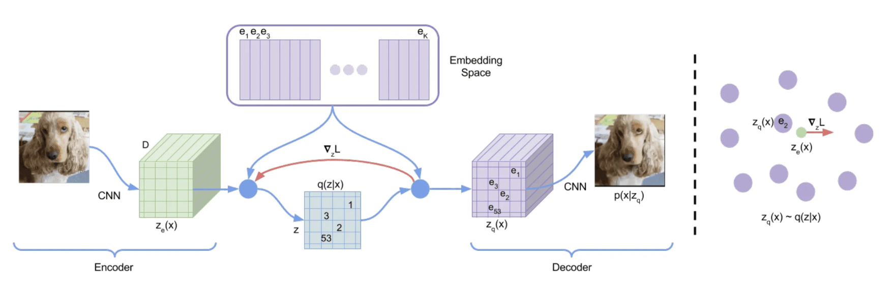
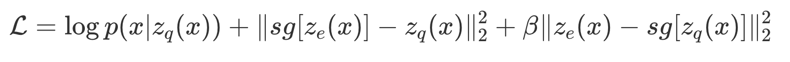

## VQ-VAE

Энкодер принимает на вход картинку  x и выдаёт на выходе тензор  z_e(x). На рисунке этот тензор имеет размерность  M × M × D: последняя размерность совпадает с длиной кодовых векторов, а  M × M — это пространственная размерность выхода CNN.  Каждый из  M × M векторов из z_e(x) отображается в ближайший к нему по  L_2 - расстоянию кодовый вектор. После такой процедуры тензор  z_e(x) переходит в тензор  z_q(x), состоящий из  M × M кодовых векторов. Декодер получает на вход тензор  z_q(x) и отображает его в исходную картинку.

Отображение выхода энкодера в кодовые векторы не дифференцируемо, поэтому при обучении применяется следующий трюк: при обратном проходе градиент копируется напрямую из декодера в энкодер, пропуская при этом слой, отображающий выходы энкодера в кодовые векторы. Почти как straight-through estimator

Использование straight-through estimator, однако, не позволяет обучать сами кодовые векторы, так как по ним не будут вычисляться градиенты. Поэтому лосс для обучения модели складывается из трёх компонент:

Первое слагаемое — это ELBO с точностью до константы. Второе слагаемое отвечает за сдвиг кодовых векторов в сторону выходов энкодера. Чтобы не получилось так, что выходы энкодера всё время меняют кодовые векторы за счёт второй компоненты лосса, а сами на каждой итерации выдают векторы, далёкие от текущих кодовых векторов, добавляется третье слагаемое. Оно отвечает за то, чтобы энкодер стремился выдавать векторы, близкие к кодовым векторам, а его значимость регулируется с помощью коэффициента β.

Во время обучения в качестве априорного распределения в латентном пространстве используется равномерное распределение  p(z) = 1/K, поэтому слагаемое  D_KL(q(z∥x) ∥ p(z)) оказывается постоянным и равным logK:

Мы потеряли регуляризационное слагаемое  D_KL(q(z∥x) ∥ p(z)), из-за чего распределение энкодера не было обязано приближать собой априорное распределение и осталось его узким подмножеством, поэтому будем получать просто шумы вместо хороших картинок

Чтобы исправить эту проблему, авторы предлагают с помощью дополнительной модели выучить априорное распределение p(z) тех латентных переменных, которые модель научилась генерировать в процессе обучения. Поскольку любое кодовое представление можно вытянуть в последовательность, а самих кодов — конечное наперёд заданное число, то эта задача близка к задаче обучения языковой модели.

В случае VQ-VAE обучение PixelCNN происходит не на пикселях, а на латентных кодах. Семплирование из выученного априорного распределения выглядит гораздо лучше, чем попытки семплировать из равномерного.
